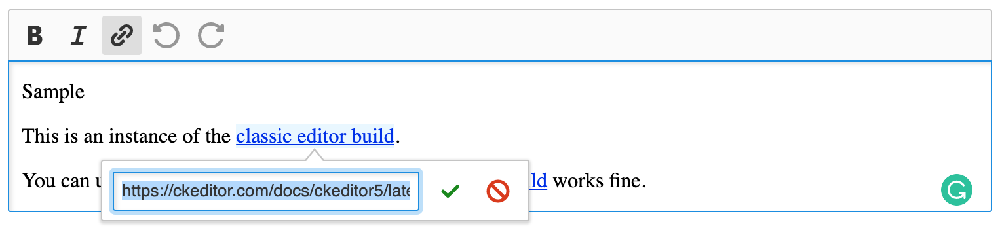

CKEditor 5 – integration with `gitlab-svgs` (proof of concept)
========================================

A fork of `ckeditor5-build-classic` that uses [gitlab-svgs](https://gitlab.com/gitlab-org/gitlab-svgs) instead of standard CKEditor 5 icons.



## Quick start

The following directory structure is required

```
/root
	/gitlab-svgs
	/ckeditor5-gitlab-svgs
```

### Building

1. In `gitlab-svgs`:
	1. Follow the [official instructions](https://gitlab.com/gitlab-org/gitlab-svgs) to build the SVG sprite.
2. In `ckeditor5-gitlab-svgs`:
	1. Call `yarn`.
	2. Call `yarn build`.

### Demo

Visit `sample/index.html` in your web server to see the demo.

## License

Licensed under the terms of [GNU General Public License Version 2 or later](http://www.gnu.org/licenses/gpl.html). For full details about the license, please check the `LICENSE.md` file or [https://ckeditor.com/legal/ckeditor-oss-license](https://ckeditor.com/legal/ckeditor-oss-license).
